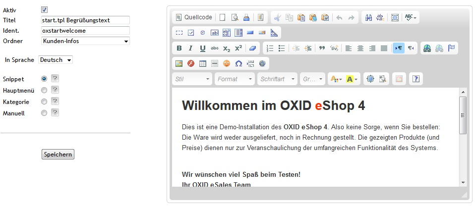

# CHF ckEditor
Bindet den ckEditor (derzeit in Version 4.2) in den Oxid E-Shop ein.
Für OXID CE 4.7.x, 4.8.x 
## Installation
1. Kopiere chf_ckeditor in dein modules Verzeichnis
2. Aktiviere das Modul im Backend unter Erweiterungen - Module - CHF ckEditor
3. Konfiguriere die .htaccess und .htpasswd Dateien unter chf_ckeditor/pdw_file_browser
4. Bei Problemen die config Dateien bearbeiten/anpasssen (chf_ckeditor/pdw_file_browser/config.php, chf_ckeditor/src/ckeditor/config.js)
5. Fertig

## Screenshots

## Probleme
1. Derzeit treten Probleme mit den Tooltops (?) auf. Diese werden nun als jQuery-Dialog geöffnet
2. kategorie-langbeschreibung lässt sich nicht speichern.

## Lizenz
Das Modul steht unter GPL.
Enthält allerdings Teile die unter einer anderen Lizenz stehen (ckeditor, pdw_file_browser).